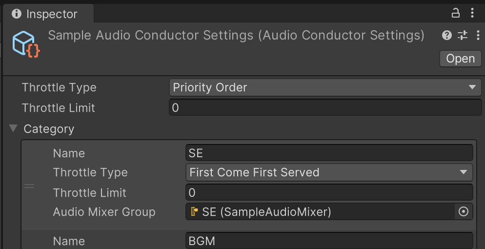
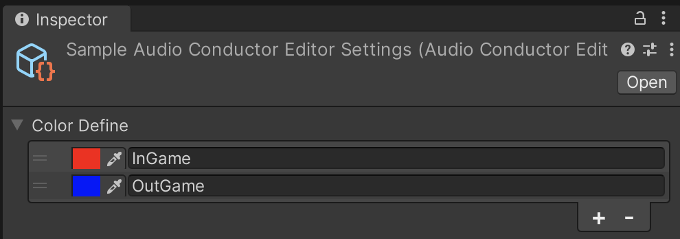
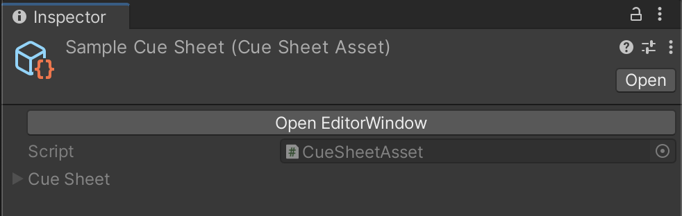
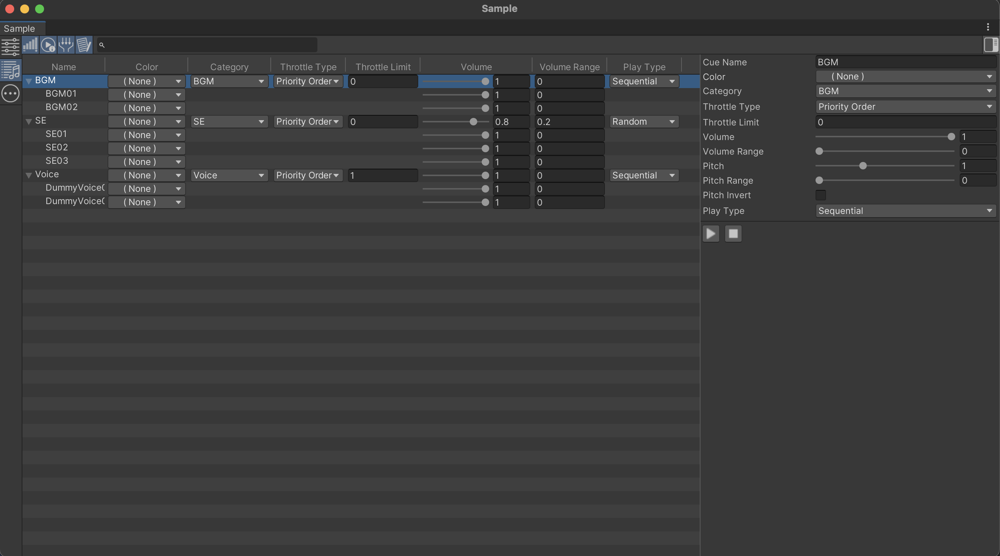
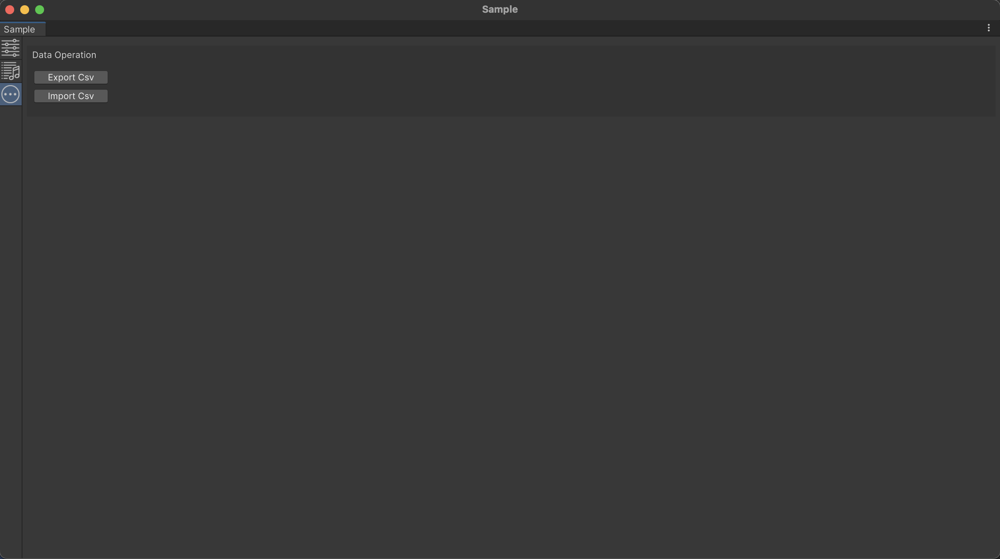
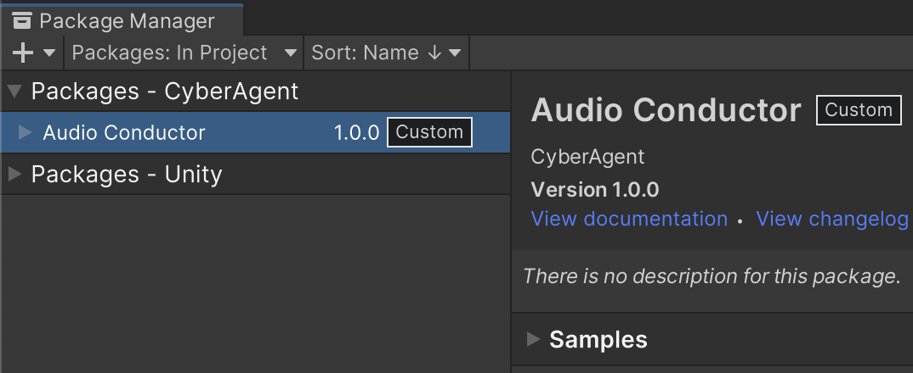
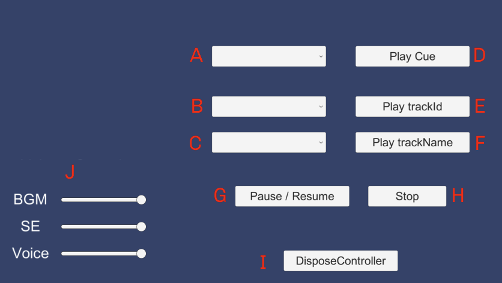

<p align="center">
  
  
</p>

# Audio Conductor

[](LICENSE.md)
[](https://github.com/CyberAgentGameEntertainment/AssetRegulationManager/pulls)
[](#Requirements)

**Docs** ([English](README.md), [日本語](README_JA.md))

Audio Conductor is a tool that enhances the usability of audio features (AudioClip/AudioSource) in Unity, providing greater convenience in managing and controlling audio assets.
You can define AudioClip and related parameters in a cue-sheet/cue/track style.

## Table of Contents

<details>
<summary>Details</summary>

- [Concept](#concept)
  - [Track](#track)
  - [Cue](#cue)
  - [Cue-sheet](#cue-sheet)
  - [Runtime settings](#runtime-settings)
  - [Category](#category)
  - [Volume](#volume)
  - [Pitch](#pitch)
  - [Throttle type/Throttle limit](#throttle-typethrottle-limit)
  - [Editor settings](#editor-settings)
- [Setup](#setup)
  - [Requirements](#requirements)
  - [Install](#install)
- [Create setting assets](#create-setting-assets)
  - [Create runtime settings asset](#create-runtime-settings-asset)
  - [Create editor settings asset](#create-editor-settings-asset)
  - [Create cue-sheet assets](#create-cue-sheet-assets)
- [Edit cue-sheet](#edit-cue-sheet)
  - [Edit cue-sheet parameters](#edit-cue-sheet-parameters)
  - [Edit cues/tracks](#edit-cuestracks)
  - [Other operations](#other-operations)
    - [Export/Import](#exportimport)
- [Play](#play)
  - [Setup runtime settings](#setup-runtime-settings)
  - [Create controller](#create-controller)
  - [Dispose controller](#dispose-controller)
- [Samples](#samples)
  - [Import sample resources](#import-sample-resources)
  - [Sample scene](#sample-scene)
  - [AudioMixer volume control](#audioMixer-volume-control)
- [License](#license)

</details>

## Concept

### Track

The unit of play.  
It has the following parameters:  

- Name
- AudioClip
- Volume
- Volume range
- Pitch
- Pitch range
- Start sample
- End sample
- Loop start sample
- Loop
- Random weight
- Priority
- Fade-in/fade-out time

When loop is enabled, the track will play from the start sample to the end sample and then loop back from the loop start sample to the end sample. When loop is disabled, the track will stop after playing from the start sample to the end sample.  

### Cue

An object that groups tracks.  
Playback by specifying the "name" or "index value" of the track.  
It has the following parameters:  

- Name
- Category ID
- Throttle type
- Throttle limit
- Volume
- Volume range
- Pitch
- Pitch range
- Play type
- Track list

There are two play types: sequential play and random play.  
Sequential play plays the track list in order from the top.  
Random play plays randomly selected tracks depending on the weight of each track.  

### Cue-sheet

An object that groups cues.  
It has the following parameters:  

- Name
- Throttle type
- Throttle limit
- Volume
- Pitch
- Cue list

### Runtime settings

It has the following parameters:  

- Throttle type
- Throttle limit
- Category list

### Category

Any category can be defined. (e.g. BGM/SE/Voice)  
Assigning `AudioMixerGroup` to a category will set it as the output for AudioSource.  

### Volume

The volume range can be set to randomly increase or decrease the volume.  
For example, if the volume is 0.5 and the volume range is 0.2, the actual volume will be randomly determined in the range of 0.4 to 0.6. (Value range 0.00 to 1.00)  
Volume range can be set to cue/track.  
The AudioSource volume is the value calculated by multiplying the cue-sheet/cue/track actual volume. 

### Pitch

The Pitch range can be set to randomly increase or decrease the pitch.
For example, if the pitch is 1 and the pitch range is 0.02, the actual pitch will be randomly determined in the range of 0.98 to 1.02. (Value range 0.01 to 3.00)  
Pitch range can be set for a cue/track.  
The AudioSource pitch is the value calculated by multiplying the cue-sheet/cue/track actual pitch.  
If pitch Invert is enabled, the value will be a negative number.  

### Throttle type/Throttle limit

Throttle limit means "Limit of concurrent play". The number of audios that are allowed to be played at the same time. (0 is unlimited).  
If a new play request is made while the limit is reached, it will be handled depending on the throttle type.  

Throttle type means "Concurrent play control type". There are two throttle types: "priority order" and "first come, first served".  
In the case of "priority order," if the priority of the new request is greater than or equal to the priority of the currently playing track, the track with the lowest priority is stopped and the new request is played. In the case of "first come, first served", the new request will be rejected.

The evaluation is made in order of cue, cue-sheet, category, and runtime settings.  

### Editor settings

It has the following parameters:  

- Color definition list 

Color definitions consist of name and color.  
It can be associated with a cue/track when editing a cue-sheet.  
For example, "Editing: red" and "Done: green" make edit status easier to understand.  

## Setup

### Requirements

* Unity 2021.3 or higher.

### Install

1. Open the Package Manager from Window > Package Manager
2. "+" button > Add package from git URL
3. Enter the following
    * https://github.com/CyberAgentGameEntertainment/AudioConductor.git?path=/Packages/AudioConductor

<p align="center">
  
</p>

Or, open Packages/manifest.json and add the following to the dependencies block.  

```json
{
    "dependencies": {
      "jp.co.cyberagent.audioconductor": "https://github.com/CyberAgentGameEntertainment/AudioConductor.git?/Packages/AudioConductor"
    }
}
```

If you want to set the target version, write as follows.  

* https://github.com/CyberAgentGameEntertainment/AudioConductor.git?/Packages/AudioConductor#1.0.0

To update the version, rewrite the version as described above.  
If you don't want to specify a version, you can also update the version by editing the hash of this library in the package-lock.json file.  

```json
{
  "dependencies": {
      "jp.co.cyberagent.audioconductor": {
      "version": "https://github.com/CyberAgentGameEntertainment/AudioConductor.git?/Packages/AudioConductor",
      "depth": 0,
      "source": "git",
      "dependencies": {},
      "hash": "..."
    }
  }
}
```

## Create setting assets

You Create assets from **Assets > Create > Audio Conductor**.  
This menu can also be opened from the context menu of the project view.  

<p align="center">
  
</p>

### Create runtime settings asset

You create a runtime settings asset by selecting **Settings**.  
Can create more than one of this asset, but only one can be used.  
You edit it in the inspector.  

<p align="center">
  
</p>

### Create editor settings asset

You create a editor settings asset by selecting **EditorSettings**.  
Only one of this asset should be created in a project.  
You edit it in the inspector.  

<p align="center">
  
</p>

### Create cue-sheet assets

You create a cue-sheet assets by selecting **CueSheetAsset**.  
This may be created as many times as needed.  
You edit it in the editor window that open from the inspector. See [Edit cue-sheet](#edit-cue-sheet) for more information.  

<p align="center">
  
</p>

## Edit cue-sheet

The operation selection buttons vertically aligned on the left side switch between panes.  
From the top: [Edit cue-sheet parameters](#edit-cue-sheet-parameters), [Edit cues/tracks](#edit-cuestracks), [Other operations](#other-operations).  

<p align="center">
  
</p>

### Edit cue-sheet parameters

In this pane, you edit the cue-sheet name, concurrent play control, volume, pitch, etc.  

<p align="center">
  
</p>

### Edit cues/tracks

This pane consists of a multi-column list and an inspector.  
At the top of the list is a toggle button to show/hide columns and a search field.  
In this pane, you can add, delete and edit cues/tracks.  

<p align="center">
  
</p>

#### Add cues/tracks

Add a cue/track from the context menu. Tracks can only be added with the parent cue selected.  
You can also add a cue/track by drag-and-drop an AudioClip in project onto the list.  

<p align="center">
  
</p>

#### Remove cues/tracks

Remove cues/tracks from the context menu.  
You can also remove them with the backspace key or delete key.  

<p align="center">
  
</p>

#### Edit cue/track parameters

Some parameters of cues/tracks are shown on the list.  
You can edit Values from pull-down menus or input fields.  
When cues/tracks are selected, detailed parameters are displayed in the inspector. You can also preview the cue/track.

<p align="center">
  
</p>

<p align="center">
  
</p>

### Other operations

Operations currently provided are export/import.  

<p align="center">
  
</p>

#### Export/Import

You can export a cue-sheet to a csv file or import from a csv file.  
An exported csv file will be named _[CueSheetName]_.csv.  
If each value over the value range when imported, it is rounded to within the value range. AudioClips are assigned if found by `AssetDatabase.FindAssets`.  

## Play

### Setup runtime settings

The first argument of `AudioConductorInterface.Setup` specifies the runtime configuration asset.  
The second argument is described in [Dispose controller](#dispose-controller).  

```cs
var settings = Resources.Load<AudioConductorSettings>("***");
AudioConductorInterface.Setup(settings, OnCueSheetUnused);
```

### Create controller

The first argument of `AudioConductorInterface.CreateController` specifies the cue-sheet asset.  
The second argument is the index value of the cue or the name of the cue.  
The return value is an `ICueController` instance, which can call methods such as play/stop/pause/resume.  
An `ITrackController` instance is returned when a play method is called. This instance can control the volume, pitch, current time-sample, and others, as well as set a callback for when audio stopped.  

```cs
var cueSheetAsset = Resources.Load<CueSheetAsset>("***");
_controller = AudioConductorInterface.CreateController(cueSheetAsset, 0);
var trackController = _controller.Play(0);
trackController.AddStopAction(() => Debug.Log("Audio stopped."));
```

### Dispose controller

Keep the created `ICueController` instance in the member field and dispose it when you are done using it.  
If a controller is disposed during play, all related audios will be stopped.  
If the disposed controller is the last controller in a cue-sheet, the callback specified in the second argument of `AudioConductorInterface.Setup` is called. For example, use it to unload asset bundles

```cs
_controller.Dispose();
```

## Samples

### Import sample resources

You import the sample resources by pressing the Import button from **Package Manager > Audio Conductor > Samples**.  
When import is complete, open and run the sample scene.  

```
Assets/Samples/AudioConductor/[VERSION]/Sample/SampleScene.unity
```

<p align="center">
  
</p>

### Sample scene

- A: Select a cue
- B: Select an index of a track
- C: Select a track name
- D: Play the cue selected in 1 depending on the play type
- E: Play the track selected in 2
- F: Play the track selected in 3
- G: Pause/resume the audio playing
- H: Stop all audios
- I: Dispose all `ICueController`
- J: Control volumes

<p align="center">
  
</p>

### AudioMixer volume control

In order to control AudioMixer volume from scripts, you need to set in the AudioMixer inspector.

<p align="center">
  
</p>

Parameter names can be changed from the Audio Mixer window.

<p align="center">
  
</p>

Please see the following file:

- [AudioMixerVolumeControlSample.cs](../Packages/AudioConductor/Samples~/Sample/AudioMixerVolumeControlSample.cs)
- [SampleAudioMixer.mixer](../Packages/AudioConductor/Samples~/Sample/Setting/SampleAudioMixer.mixer)

## License

This software is released under the MIT license.  
You are free to use it within the scope of the license, but the following copyright and license notices are required.  

* [LICENSE.md](/LICENSE.md)
