<p align="center">
  
  
</p>

# Audio Conductor

[](LICENSE.md)
[](https://github.com/CyberAgentGameEntertainment/AudioConductor/pulls)
[](#要件)

**ドキュメント** ([English](README.md), [日本語](README_JA.md))

Unity のオーディオ機能 (AudioClip/AudioSource) をより便利に扱うためのツールです。  
キューシート/キュー/トラック形式で AudioClip と関連するパラメータを定義することができます。  
`Conductor`クラスによるインスタンスベースの設計で、複数の独立したオーディオ管理インスタンスを作成できます。  

## 目次

<details>
<summary>詳細</summary>

- [概念](#概念)
  - [トラック](#トラック)
  - [キュー](#キュー)
  - [キューシート](#キューシート)
  - [ランタイム設定](#ランタイム設定)
  - [カテゴリ](#カテゴリ)
  - [ボリューム](#ボリューム)
  - [ピッチ](#ピッチ)
  - [同時再生制御](#同時再生制御)
  - [エディタ設定](#エディタ設定)
- [セットアップ](#セットアップ)
  - [要件](#要件)
  - [インストール](#インストール)
- [アセットを作成する](#アセットを作成する)
  - [ランタイム用設定アセットを作成する](#ランタイム用設定アセットを作成する)
  - [エディタ用設定アセットを作成する](#エディタ用設定アセットを作成する)
  - [キューシートアセットを作成する](#キューシートアセットを作成する)
- [キューシートを編集する](#キューシートを編集する)
  - [キューシートのパラメータを編集する](#キューシートのパラメータを編集する)
  - [キュー/トラックを編集する](#キュートラックを編集する)
  - [その他操作](#その他操作)
    - [エクスポート/インポート](#エクスポートインポート)
- [再生する](#再生する)
  - [Conductor の初期化](#conductor-の初期化)
  - [キューシートの登録](#キューシートの登録)
  - [サウンドの再生](#サウンドの再生)
  - [停止/一時停止/再開](#停止一時停止再開)
  - [ボリュームとピッチの制御](#ボリュームとピッチの制御)
  - [フェード制御](#フェード制御)
  - [情報の取得](#情報の取得)
  - [キューシートプロバイダー](#キューシートプロバイダー)
  - [Conductor の破棄](#conductor-の破棄)
- [Cue Enum Definition](#cue-enum-definition)
  - [概要](#概要)
  - [エディタウィンドウを開く](#エディタウィンドウを開く)
  - [Sheet Group によるグルーピング](#sheet-group-によるグルーピング)
  - [デフォルト設定](#デフォルト設定)
  - [生成の実行 / バッチ生成](#生成の実行--バッチ生成)
  - [生成コード例](#生成コード例)
- [エディタの多言語対応](#エディタの多言語対応)
- [サンプル](#サンプル)
  - [サンプルのインポート](#サンプルのインポート)
  - [サンプルシーン](#サンプルシーン)
- [v1 からの移行](#v1-からの移行)
  - [API マッピング](#api-マッピング)
  - [キューシートアセットの互換性](#キューシートアセットの互換性)
  - [Addressables サポート](#addressables-サポート)
- [ライセンス](#ライセンス)

</details>

## 概念

### トラック

再生する単位です。  
以下のようなパラメータを持ちます。  

- 名前
- AudioClip
- ボリューム
- ボリューム幅 (Volume range)
- ピッチ
- ピッチ幅 (Pitch range)
- 開始サンプル値 (Start sample)
- 終了サンプル値 (End sample)
- ループ時開始サンプル値 (Loop start sample)
- ループの有無
- ランダム再生時の重み (Random weight)
- 発音数制御時の優先度 (Priority)
- ピッチ反転 (Pitch invert)
- フェードイン/フェードアウト時間 (Fade time)

ループ有り設定の場合、開始サンプル値から終了サンプル値までを再生した後にループ時開始サンプル値から終了サンプル値までを繰り返し再生します。  
ループ無し設定の場合、開始サンプル値から終了サンプル値までを再生して停止します。  

### キュー

トラックを束ねるオブジェクトです。  
「名前」または「キュー ID」を用いてサウンド再生をリクエストします。  
以下のようなパラメータを持ちます。  

- 名前
- キュー ID
- カテゴリ ID
- 同時再生制御タイプ (Throttle type)
- 同時再生数 (Throttle limit)
- ボリューム
- ボリューム幅 (Volume range)
- ピッチ
- ピッチ幅 (Pitch range)
- ピッチ反転 (Pitch invert)
- 再生タイプ (Play type)
- トラックリスト

再生タイプには「順次再生 (sequential)」と「ランダム再生 (random)」の 2 つがあります。  
順次再生はトラックリストを先頭から順番に再生します。  
ランダム再生はトラックごとの重みに従ってランダムに選出したトラックを再生します。  

### キューシート

キューを束ねるオブジェクトです。  
以下のようなパラメータを持ちます。  

- 名前
- 同時再生制御タイプ (Throttle type)
- 同時再生数 (Throttle limit)
- ボリューム
- ピッチ
- ピッチ反転 (Pitch invert)
- キューリスト

### ランタイム設定

以下のようなパラメータを持ちます。  

- 同時再生数制御タイプ (Throttle type)
- 同時再生数 (Throttle limit)
- 管理プールの容量 (Managed pool capacity)
- ワンショットプールの容量 (One-shot pool capacity)
- プール済みオブジェクトの非アクティブ化 (Deactivate pooled objects)
- カテゴリリスト

### カテゴリ

任意のカテゴリを定義することができます。(例: BGM/SE/Voice)  
以下のようなパラメータを持ちます。  

- 名前
- 同時再生制御タイプ (Throttle type)
- 同時再生数 (Throttle limit)
- AudioMixerGroup

カテゴリに`AudioMixerGroup`を割り当てることで、再生時に AudioSource の出力先に設定されます。  

### ボリューム

ボリューム幅を設定すると再生時の音量をランダムに増減することができます。  
例えば、ボリューム 0.5 でボリューム幅 0.2 の場合、0.4〜0.6 の範囲でランダムにボリュームが決定します。 (値域 0.00〜1.00)  
ボリューム幅はキュー/トラックに設定できます。  
AudioSource に設定されるボリュームは、マスターボリューム、カテゴリボリューム、キューシートボリューム、キューの実効ボリューム、トラックの実効ボリュームの 5 要素を乗算した値です。  

マスターボリュームは Conductor インスタンス内で再生される全てのサウンドに適用されます。カテゴリボリュームは Conductor インスタンス内で再生される指定カテゴリのサウンドに適用されます。  
各`Conductor`インスタンスは、同一の Settings アセットを共有している場合でも、マスターボリュームとカテゴリボリュームを独立して管理します。  
また、フェードイン/フェードアウトや再生ごとのボリューム調整（`SetVolume`）は、これらとは独立した乗算係数として適用されます。  

### ピッチ

ピッチ幅を設定すると再生時のピッチをランダムに増減することができます。  
例えば、ピッチ 1 でピッチ幅 0.02 の場合、0.98〜1.02 の範囲でランダムにピッチが決定します。(値域 0.01〜3.00)  
ピッチ幅はキュー/トラックに設定できます。  
AudioSource に設定されるピッチはキューシート/キュー/トラックのピッチを乗算した値です。  
ピッチ反転を有効にすると値が負の数になり、逆再生になります。  
また、再生ごとのピッチ調整（`SetPitch`）は独立した乗算係数として適用されます。  

### 同時再生制御

同時再生数 (Throttle limit) は、同時に再生できるサウンドの上限数です。(0 は無制限)  
上限に達した状態で新たな再生リクエストをした場合、同時再生制御タイプ (Throttle type) に基づいて処理されます。  

制御タイプには「優先度順 (priority order)」と「先着順 (first come, first served)」の 2 つがあります。  
「優先度順」は新しいリクエストの優先度が再生中のトラックの優先度以上なら、最も優先度が低いトラックを停止して新しいリクエストを再生します。  
「先着順」は新しいリクエストは棄却されます。  

キュー、キューシート、カテゴリ、ランタイム設定の順で判定を行います。各スコープは独立して評価され、すべてのスコープで許可された場合のみ再生されます。  

- キュー「Footstep」の throttleLimit を 3 に設定すると、足音は最大 3 つまで同時再生されます。同じキューシート内の他のキューにはそれぞれ独自の制限が適用されます。
- キューシート「BGM」の throttleLimit を 1、throttleType を PriorityOrder に設定すると、BGM の自動切替として機能します。新しい BGM キューを再生すると、再生中の BGM が自動的に停止します。
- カテゴリ「SE」の throttleLimit を 10 に設定すると、個々のキューの制限値に関わらず、SE 全体で同時に再生できるのは最大 10 個に制限されます。

### エディタ設定

以下のようなパラメータを持ちます。  

- 色定義リスト

色定義は任意の名前と色で構成されます。  
キュー/トラックに関連付けることができます。  
例えば、「編集中:赤」「完了:緑」とすることで作業状況を分かりやすくするといった使い方があります。  

## セットアップ

### 要件

- Unity 2022.3 以上

### インストール

インストールは以下の手順で行います。  

1. **Window > Package Manager** を選択
2. **「+」ボタン > Add package from git URL** を選択
3. 以下を入力してインストール
    - https://github.com/CyberAgentGameEntertainment/AudioConductor.git?path=/Packages/AudioConductor

<p align="center">
  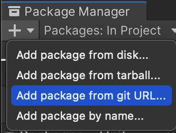
</p>

あるいは **Packages/manifest.json** を開き、**dependencies** ブロックに以下を追記します。  

```json
{
    "dependencies": {
        "jp.co.cyberagent.audioconductor": "https://github.com/CyberAgentGameEntertainment/AudioConductor.git?path=/Packages/AudioConductor"
    }
}
```

バージョンを指定したい場合には以下のように記述します。  

* https://github.com/CyberAgentGameEntertainment/AudioConductor.git?path=/Packages/AudioConductor#2.0.0

バージョンを更新するには上述の手順でバージョンを書き換えてください。  
バージョンを指定しない場合には、**Packages/package-lock.json** ファイルを開いて本ライブラリの箇所のハッシュを書き換えることで更新できます。  

```json
{
    "dependencies": {
        "jp.co.cyberagent.audioconductor": {
            "version": "https://github.com/CyberAgentGameEntertainment/AudioConductor.git?path=/Packages/AudioConductor",
            "depth": 0,
            "source": "git",
            "dependencies": {},
            "hash": "..."
        }
    }
}
```

## アセットを作成する

**Assets > Create > Audio Conductor** から生成するアセットを選択します。  
このメニューはプロジェクトビューのコンテキストメニューからも開くことができます。  

<p align="center">
  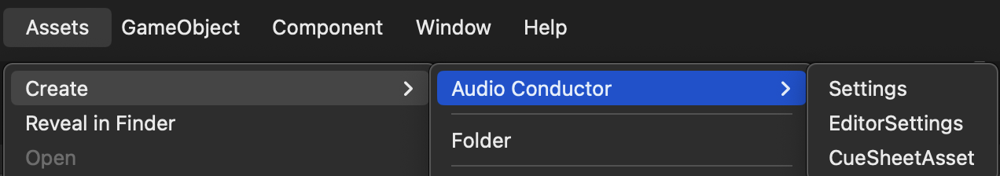
</p>

### ランタイム用設定アセットを作成する

**Settings**を選択してランタイム用設定アセットを作成します。  
このアセットは複数作成できますが、1 つの`Conductor`インスタンスにつき 1 つ使用します。  
複数の`Conductor`インスタンスで同一の Settings アセットを共有できます。  
マスターボリュームやカテゴリボリュームなどのランタイム状態はインスタンスごとに独立して管理されます。  
編集はインスペクタから行います。  

<p align="center">
  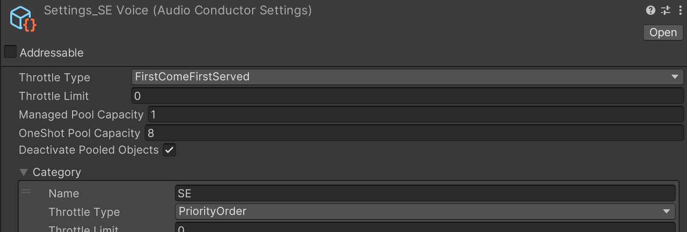
</p>

### エディタ用設定アセットを作成する

**EditorSettings**を選択してエディタ用設定アセットを作成します。  
このアセットはプロジェクトに 1 つしか作成しないでください。  
編集はインスペクタから行います。  

<p align="center">
  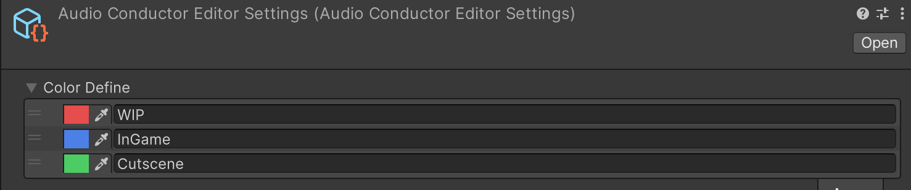
</p>

### キューシートアセットを作成する

**CueSheetAsset**を選択してキューシートアセットを作成します。  
このアセットは必要な数だけ作成して構いません。  
編集はインスペクタから開く専用のエディタウィンドウで行います。詳細は[キューシートを編集する](#キューシートを編集する) を参照してください。  

<p align="center">
  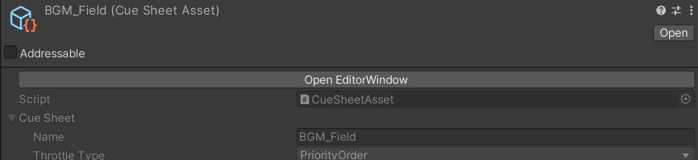
</p>

## キューシートを編集する

左端に縦に並んだ操作選択ボタンでペインを切り替えます。  
上から順番に[キューシートのパラメータを編集](#キューシートのパラメータを編集する)、[キュー/トラックを編集](#キュートラックを編集する)、[その他操作](#その他操作) です。  

ウィンドウ上部には **Settings** ドロップダウンがあり、このキューシートに関連付ける`AudioConductorSettings`アセットを選択します。選択した Settings アセットのカテゴリリストが、キューへのカテゴリ割り当てに使用されます。  

<p align="center">
  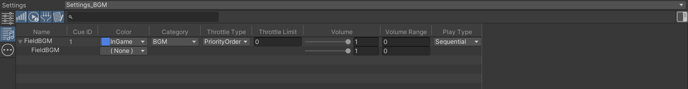
</p>

### キューシートのパラメータを編集する

このペインではキューシートの名前、同時再生制御、ボリューム、ピッチなどを編集します。  

<p align="center">
  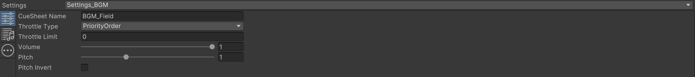
</p>

### キュー/トラックを編集する

このペインはマルチカラムリストとインスペクタから構成されています。  
リスト上部にはカラムの表示/非表示の切り替えトグルボタンと検索フィールドがあります。  
このペインではキュー/トラックの追加/削除やパラメータの編集を行います。  
リストには「Cue ID」カラムが用意されており、キューを選択するとインスペクタにもキュー ID が表示されます。キュー ID は型安全な再生のための整数識別子です。詳細は [Cue Enum Definition](#cue-enum-definition) を参照してください。  

<p align="center">
  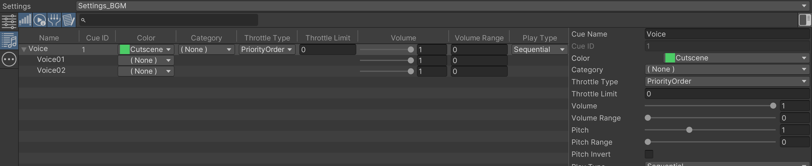
</p>

#### キュー/トラックを追加する

コンテキストメニューからキュー/トラックを追加します。トラックは親となるキューを選択している状態でないと追加できません。  
また、プロジェクト上の AudioClip をリスト上にドラッグ＆ドロップしてキュー/トラックを追加できます。  

<p align="center">
  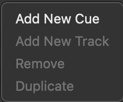
</p>

#### キュー/トラックを削除する

コンテキストメニューから選択したキュー/トラックを削除します。  
バックスペースキー/デリートキーでも削除できます。  

<p align="center">
  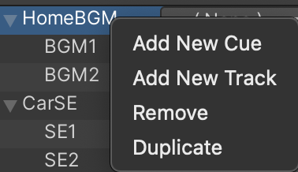
</p>

#### キュー/トラックのパラメータを編集する

リスト上にはキュー/トラックの一部パラメータが表示されています。  
プルダウンや入力フィールドから値を設定することができます。  
キュー/トラックを選択すると、選択したキュー/トラックの詳細なパラメータがインスペクタに表示されます。  
インスペクタには各種パラメータの編集機能の他、キュー/トラックの試聴機能もあります。  

<p align="center">
  
</p>

<p align="center">
  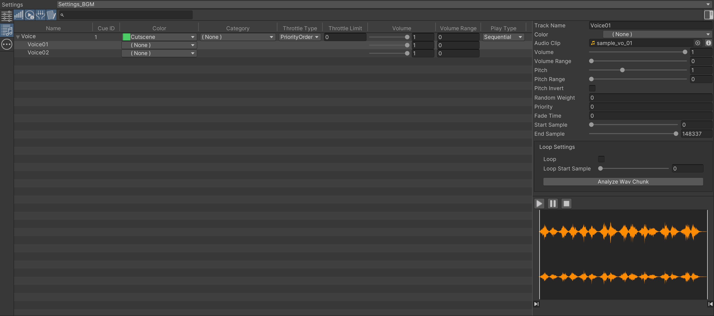
</p>

### その他操作

その他操作としてエクスポート/インポート機能を提供しています。  

<p align="center">
  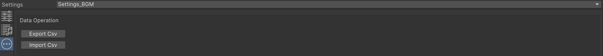
</p>

#### エクスポート/インポート

キューシートの内容を csv ファイルにエクスポート/csv ファイルからインポートできます。  
エクスポートした csv ファイルは _[キューシートの名前].csv_ というファイル名になります。  
インポートの際に各値が値域を超えていた場合、値域に収まるように丸められます。  
AudioClip は `AssetDatabase.FindAssets` で見つかれば割り当てます。  

## 再生する

### Conductor の初期化

ランタイム用設定アセットを指定して`Conductor`インスタンスを作成します。コンストラクタは DontDestroyOnLoad な GameObject と内部 MonoBehaviour を自動的に作成するため、手動での Update 呼び出しは不要です。  

```cs
var settings = Resources.Load<AudioConductorSettings>("Settings");
var conductor = new Conductor(settings);
```

### キューシートの登録

`Conductor`インスタンスにキューシートアセットを登録します。戻り値の`CueSheetHandle`は以降の操作でキューシートを指定するために使用します。  

```cs
var cueSheetAsset = Resources.Load<CueSheetAsset>("CueSheet");
var handle = conductor.RegisterCueSheet(cueSheetAsset);
```

### サウンドの再生

`Play`はキュー名またはキュー ID を指定してサウンドを再生します。戻り値の`PlaybackHandle`で再生中のオーディオを制御できます。  
`PlayOptions`を渡すことで再生動作をカスタマイズできます（例: ループ、トラック選択、フェードイン）。  

```cs
// キュー名で再生
var playback = conductor.Play(handle, "CueName");

// キュー ID で再生
var playback = conductor.Play(handle, cueId);

// オプション付きで再生
var playback = conductor.Play(handle, "CueName", new PlayOptions
{
    IsLoop = true,
    FadeTime = 1.0f
});

// トラックインデックスを指定して再生
var playback = conductor.Play(handle, "CueName", new PlayOptions
{
    TrackIndex = 2
});

// トラック名を指定して再生
var playback = conductor.Play(handle, "CueName", new PlayOptions
{
    TrackName = "TrackName"
});
```

`PlayOptions.Selector` にカスタム `ITrackSelector` を指定することで、キューに設定されたトラック選択ロジックを上書きすることもできます。  

`PlayOneShot`はハンドルを返さないファイア・アンド・フォーゲット方式の再生メソッドです。  

```cs
conductor.PlayOneShot(handle, "CueName");
conductor.PlayOneShot(handle, cueId);
```

### 停止/一時停止/再開

`PlaybackHandle`を指定して再生中のオーディオを制御します。  
`StopAll(fadeTime: ...)` でフェードアウトされるのは `Play` で開始した managed playback のみです。`PlayOneShot` で開始した OneShot playback は常に即時停止されます。  

```cs
// 停止
conductor.Stop(playback);

// フェードアウト付き停止
conductor.Stop(playback, fadeTime: 1.0f);

// 全再生を即時停止
conductor.StopAll();

// managed playback をフェードアウト付きで停止
// OneShot playback は即時停止
conductor.StopAll(fadeTime: 1.0f);

// 一時停止 / 再開
conductor.Pause(playback);
conductor.Resume(playback);
```

### ボリュームとピッチの制御

ボリュームとピッチは複数のレベルで制御できます。  
- 再生ごと: 単一の再生中サウンドのボリューム/ピッチを調整します。
- マスターボリューム: Conductor インスタンス内の全サウンドのボリュームを調整します。
- カテゴリボリューム: Conductor インスタンス内の指定カテゴリに属する全サウンドのボリュームを調整します。

```cs
// 再生ごとのボリュームとピッチ
conductor.SetVolume(playback, 0.5f);
conductor.SetPitch(playback, 1.2f);

// マスターボリューム
conductor.SetMasterVolume(0.8f);
var masterVolume = conductor.GetMasterVolume();

// カテゴリボリューム
conductor.SetCategoryVolume(categoryId, 0.5f);
var categoryVolume = conductor.GetCategoryVolume(categoryId);
```

### フェード制御

再生時や停止時にフェード時間とカスタムフェーダーを指定できます。  
`IFader`インターフェースでカスタムフェードカーブを定義できます。`Faders.Linear`としてリニアフェーダーを用意しています。  

```cs
// フェードイン付き再生
var playback = conductor.Play(handle, "CueName", new PlayOptions
{
    FadeTime = 1.0f,
    Fader = Faders.Linear
});

// カスタムフェーダーによるフェードアウト付き停止
conductor.Stop(playback, fadeTime: 2.0f, fader: Faders.Linear);
```

### 情報の取得

登録済みのキューシート、キュー、トラックの情報を取得できます。  

```cs
// 登録済みキューシート情報の取得
List<CueSheetInfo> sheetInfos = conductor.GetCueSheetInfos();

// キューシートのキュー情報の取得
List<CueInfo> cueInfos = conductor.GetCueInfos(handle);

// キューのトラック情報の取得
List<TrackInfo> trackInfos = conductor.GetTrackInfos(handle, "CueName");

// キュー名からキュー ID の検索（またはその逆）
int? cueId = conductor.GetCueId(handle, "CueName");
string? cueName = cueId.HasValue ? conductor.GetCueName(handle, cueId.Value) : null;

// 再生中かどうかの確認
bool isPlaying = conductor.IsPlaying(playback);

// カテゴリに割り当てられた AudioMixerGroup の取得
AudioMixerGroup? mixerGroup = conductor.GetAudioMixerGroup(categoryId);
```

事前確保したリストに結果を書き込む allocation-free のオーバーロードも用意しています。  

```cs
var sheetInfos = new List<CueSheetInfo>();
conductor.GetCueSheetInfos(sheetInfos);

var cueInfos = new List<CueInfo>();
conductor.GetCueInfos(handle, cueInfos);

var trackInfos = new List<TrackInfo>();
conductor.GetTrackInfos(handle, "CueName", trackInfos);
```

### キューシートプロバイダー

`Conductor`のコンストラクタに`ICueSheetProvider`を渡すことで、CueSheetAsset のロードとリリースを Conductor に委譲できます。
プロジェクトのアセット管理方式に合わせて`ICueSheetProvider`インターフェースを実装してください。

一般的なユースケース向けに、シンプルな組み込み実装を提供しています。

```cs
// ResourcesCueSheetProvider を使用
var provider = new ResourcesCueSheetProvider();
var conductor = new Conductor(settings, provider);
var handle = await conductor.RegisterCueSheetAsync("CueSheets/MyCueSheet");
```

```cs
// AddressableCueSheetProvider を使用（Addressables パッケージが必要）
var provider = new AddressableCueSheetProvider();
var conductor = new Conductor(settings, provider);
var handle = await conductor.RegisterCueSheetAsync("address_key");
```

Addressables サポートは`com.unity.addressables`パッケージをインストールすると自動的に有効になります。手動でのシンボル定義は不要です。

### Conductor の破棄

登録済みのキューシートが不要になったら `UnregisterCueSheet` でその登録を解除します。  
これはキューシートの登録解除（必要に応じて provider 管理のリソース解放）だけを行い、すでに再生中のオーディオは停止しません。  
再生中の音声も止めたい場合は、`Stop`、`StopAll`、または `Dispose` を明示的に呼び出してください。  
`Conductor`インスタンスの使用が完了したら、`Dispose`を呼び出して全オーディオの停止と全リソースのクリーンアップを行います。  

```cs
// 特定のキューシート登録を解除
conductor.UnregisterCueSheet(handle);

// 必要に応じて再生中オーディオを明示的に停止
conductor.StopAll();

// Conductor の破棄（全オーディオ停止、全キューシート登録解除、ルート GameObject の破棄）
conductor.Dispose();
```

## Cue Enum Definition

### 概要

Cue Enum Definition 機能は、CueSheetAsset に定義されたキュー ID から型安全な C# enum コードを自動生成します。  
マジックストリングやマジックナンバーの代わりに enum 値でキューを参照できるようになります。  

### エディタウィンドウを開く

**Tools > Audio Conductor > Cue Enum Definition** からエディタウィンドウを開きます。  
ウィンドウは左側にツリービュー、右側にインスペクタで構成されています。  

<p align="center">
  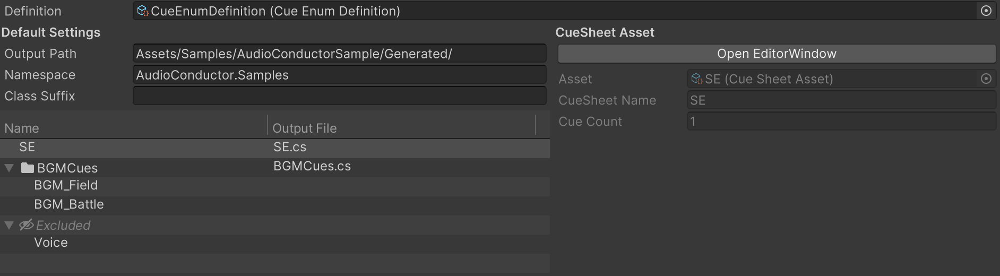
</p>

プロジェクト内の CueSheetAsset はツリービューに自動登録されます。新しい CueSheetAsset が作成されると、Path Rule（後述）に基づいて適切な領域に自動配置されるか、デフォルトではトップレベルに追加されます。  

ツリービューでは CueSheetAsset を 3 つの領域に分けて管理します。  
- トップレベルの CueSheetAsset: ルート直下に配置された各 CueSheetAsset は、それぞれ個別のコードファイルを生成します。
- Sheet Group: 複数の CueSheetAsset をまとめ、1 つの統合コードファイルを生成するグループです。**+ Sheet Group** ボタンでグループを作成し、CueSheetAsset をドラッグして追加します。
- Excluded: コード生成から除外する CueSheetAsset を配置する特殊なグループです。ここに置かれたアセットからはコードが生成されません。

### Sheet Group によるグルーピング

Sheet Group は複数の CueSheetAsset を 1 つの生成ファイルにグループ化します。各 Sheet Group には以下の設定があります。  

- File Name: 出力ファイル名（拡張子なし）。
- Output Path: 出力ディレクトリ。デフォルト設定を使用できます。
- Namespace: 生成コードの名前空間。デフォルト設定を使用できます。
- Class Suffix: enum 型名に付加するサフィックス。デフォルト設定を使用できます。
- Path Rule: 自動アセット割当用の Glob パターン。このパターンに一致するパスに新しい CueSheetAsset が作成されると、自動的にこの Sheet Group に追加されます。`*`、`**`、`**/`、`?` のワイルドカードをサポートしています。

Excluded グループにも **Path Rule** 設定があります。新しい CueSheetAsset が Excluded の Path Rule に一致すると、自動的に Excluded グループに配置されます。Excluded の Path Rule は Sheet Group の Path Rule より優先して評価されます。  

<p align="center">
  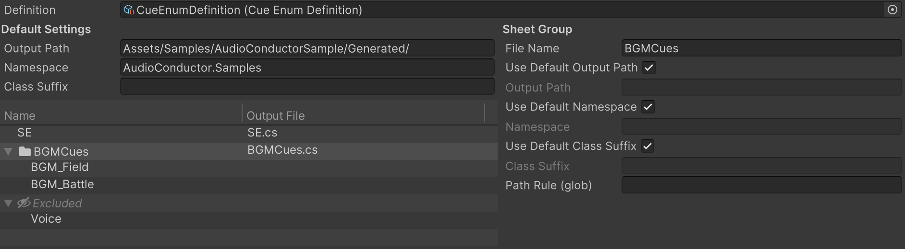
</p>

<p align="center">
  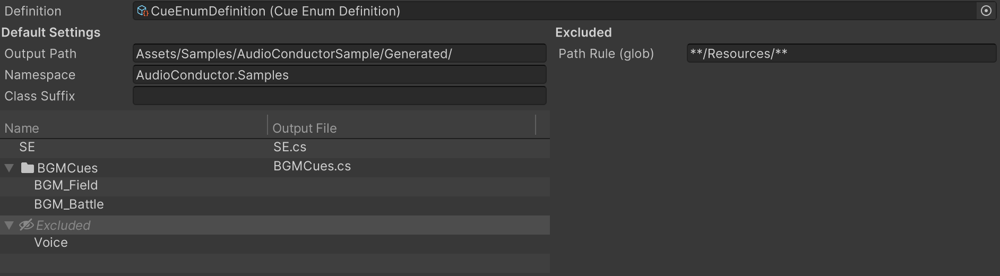
</p>

### デフォルト設定

Output Path、Namespace、Class Suffix のデフォルト値はエディタウィンドウ上部で設定できます。各 FileEntry は「Use Default」トグルを有効にすることでこれらのデフォルト値を使用できます。  

### 生成の実行 / バッチ生成

- エディタウィンドウ下部の **Generate** ボタンをクリックしてコードを生成します。
- バッチ生成（CI 等）では **Tools > Audio Conductor > Generate Cue Enums** を使用するか、コマンドラインから以下を実行します。

```bash
Unity -batchmode -projectPath . -executeMethod AudioConductor.Editor.Core.Tools.CodeGen.CueEnumBatchCommand.GenerateCueEnums
```

ビルド前には`IPreprocessBuildWithReport`により自動的にコード生成が実行されます。  

### 生成コード例

```cs
// <auto-generated/>
using System;

namespace AudioConductor.Generated
{
    public enum BGMAudioIds
    {
        Track1 = 1001,
        Track2 = 1002,
    }

    public static class BGMAudioIdsExtensions
    {
        public static string GetCueSheetName(this BGMAudioIds value)
        {
            const string cueSheetName = "BGM";
            return value switch
            {
                BGMAudioIds.Track1 => cueSheetName,
                BGMAudioIds.Track2 => cueSheetName,
                _ => throw new ArgumentOutOfRangeException(nameof(value), value, null),
            };
        }
    }
}
```

## エディタの多言語対応

エディタの**ツールチップ**（各フィールドにマウスホバーしたときに表示される説明）が複数の言語に対応しています。カラムヘッダーやフィールド名などのラベルは英語のままです。  

言語を変更するには、メニューバーから **Unity > Settings...**（macOS）/ **Edit > Preferences...**（Windows）を選択して Preferences ウィンドウを開き、左ペインの **AudioConductor** を選択します。  

以下の言語をサポートしています。  
- Auto: Unity Editor の言語設定を自動検出します。
- English
- Japanese

<p align="center">
  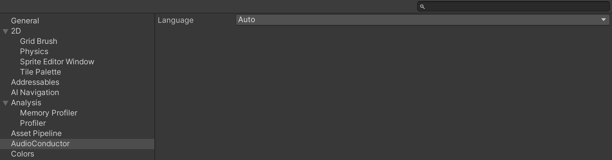
</p>

## サンプル

### サンプルのインポート

**Package Manager > Audio Conductor > Samples** から Import ボタンを押下してサンプルリソースをインポートします。  
インポートが完了したら、以下のサンプルシーンを開いて実行します。  

```
Assets/Samples/AudioConductor/[バージョン]/Audio Conductor Sample/SampleScene.unity
```

<p align="center">
  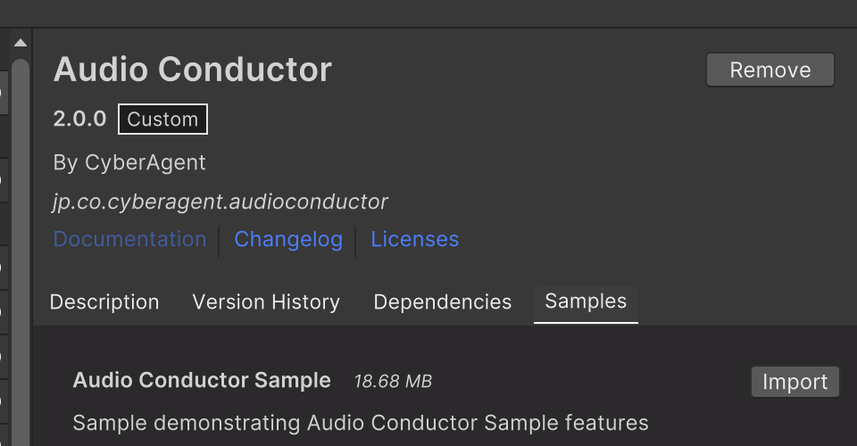
</p>

### サンプルシーン

サンプルでは 2 つの`Conductor`インスタンスをそれぞれ別の Settings アセットで使用しています。  

| Conductor | Settings アセット | 管理対象 |
|-----------|-----------------|---------|
| **BGM Conductor** | `Settings_BGM` | BGM（Field / Battle） |
| **SEVoice Conductor** | `Settings_SEVoice` | SE + Voice（カテゴリで共有） |

**BGM Conductor** は 2 つの CueSheetAsset（`BGM_Field` / `BGM_Battle`）を同一 Conductor に登録し、`PlayOptions.FadeTime` を使ったシーン切替クロスフェードをデモします。  

**SEVoice Conductor** は SE と Voice を 1 つの Conductor で管理し、カテゴリで分離しています。SE は`PlayOneShot`によるファイア・アンド・フォーゲット方式の効果音再生（ランダムトラック選択）をデモします。Voice は`ResourcesCueSheetProvider`と`RegisterCueSheetAsync`による非同期ロードをデモします。  

サンプルには 5 つのボリュームスライダーがあります。  

| スライダー | API |
|-----------|-----|
| BGM マスターボリューム | `_bgmConductor.SetMasterVolume()` |
| BGM カテゴリボリューム | `_bgmConductor.SetCategoryVolume(0, ...)` |
| SE カテゴリボリューム | `_seVoiceConductor.SetCategoryVolume(0, ...)` |
| Voice カテゴリボリューム | `_seVoiceConductor.SetCategoryVolume(1, ...)` |
| SEVoice マスターボリューム | `_seVoiceConductor.SetMasterVolume()` |

SEVoice のマスターボリュームスライダーは、この Conductor インスタンスで再生される全サウンド（SE ・ Voice 両方）に影響します。SE と Voice のカテゴリボリュームスライダーはそれぞれのカテゴリを個別に調整します。  

<p align="center">
  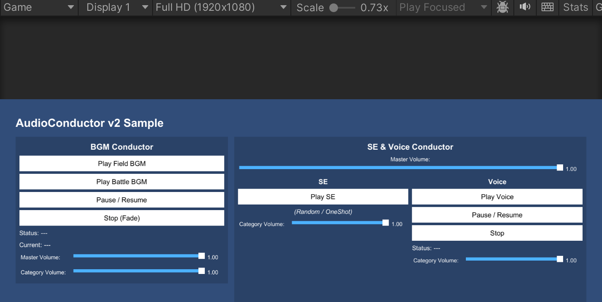
</p>

実装の詳細は以下のファイルを参照してください。  

- [SampleScene.cs](../Packages/AudioConductor/Samples~/AudioConductorSample/SampleScene.cs)

## v1 からの移行

### API マッピング

| v1 | v2 |
|---|---|
| `AudioConductorInterface.Setup(settings, callback)` | `new Conductor(settings)` |
| `AudioConductorInterface.CreateController(asset, index)` | `conductor.RegisterCueSheet(asset)` + `conductor.Play(handle, ...)` |
| `ICueController.Play(trackIndex)` | `conductor.Play(handle, cueName, options)` |
| `ICueController.Stop()` | `conductor.Stop(playbackHandle)` |
| `ICueController.Pause()` / `Resume()` | `conductor.Pause(playbackHandle)` / `Resume(playbackHandle)` |
| `ITrackController`（ボリューム/ピッチ） | `conductor.SetVolume(playbackHandle, value)` / `conductor.SetPitch(playbackHandle, value)` |
| `ICueController.Dispose()` | `conductor.UnregisterCueSheet(handle)` |
| キューシート未使用時のコールバック | 不要。`UnregisterCueSheet`を明示的に呼び出し |

### キューシートアセットの互換性

v1 で作成した CueSheetAsset は v2 でそのまま使用できます。  

- v1 アセットを v2 で読み込むと、新規フィールド`cueId`は`0`（未割り当て）で初期化されます。
- `CueSheetAssetImportChecker`が Unity 起動時およびアセットインポート時に、重複・未割り当てのキュー ID を自動的に検出して解決します。
- 名前ベースの再生 (`Play(handle, "CueName")`) はキュー ID に依存しないため、割り当て前でも動作します。
- キュー ID ベースの再生 (`Play(handle, cueId)`) は自動割り当て後に使用可能になります。

特別な移行手順は不要です。  

### Addressables サポート

Addressables 連携は`com.unity.addressables`パッケージをインストールすると自動的に有効になります。  
`AUDIOCONDUCTOR_ADDRESSABLES`プリプロセッサディレクティブはアセンブリ定義ファイルの`versionDefines`で定義されるため、手動でのシンボル定義は不要です。  

## ライセンス

本ソフトウェアは MIT ライセンスで公開しています。  
ライセンスの範囲内で自由に使っていただけますが、使用の際は以下の著作権表示とライセンス表示が必須となります。  

* [LICENSE.md](/LICENSE.md)
