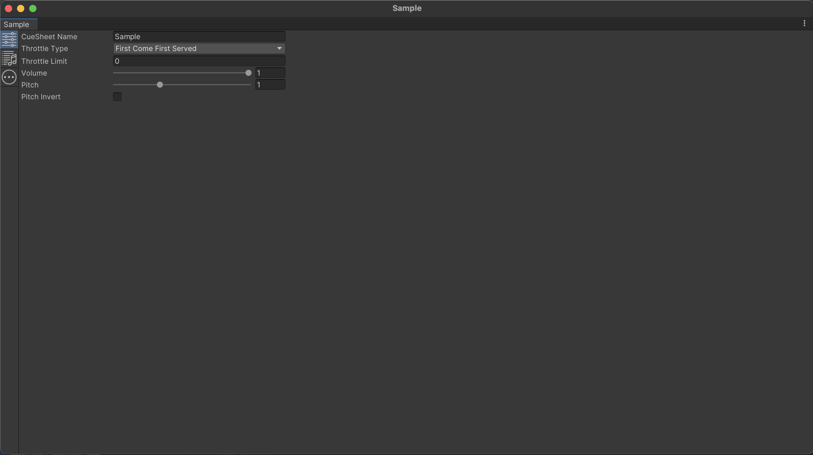
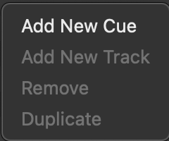
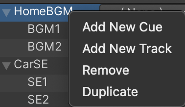
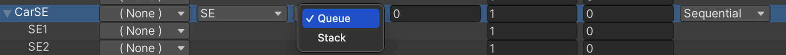
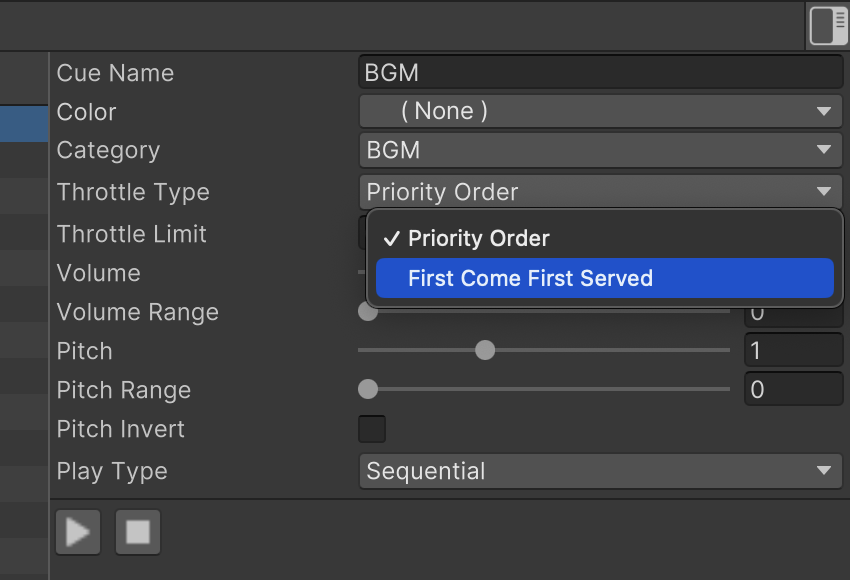
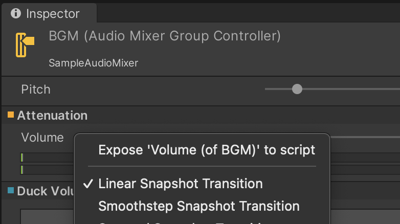
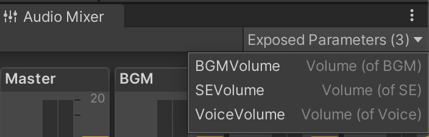

<p align="center">
  
  
</p>

# Audio Conductor

[](LICENSE.md)
[](https://github.com/CyberAgentGameEntertainment/AssetRegulationManager/pulls)
[](#Requirements)

**ドキュメント** ([English](README.md), [日本語](README_JA.md))

Unityのオーディオ機能 (AudioClip/AudioSource)をより便利に扱うためのツールです。  
キューシート/キュー/トラック形式でAudioClipと関連するパラメータを定義することができます。  

## 目次

<details>
<summary>詳細</summary>

- [概念](#概念)
  - [トラック](#トラック)
  - [キュー](#キュー)
  - [キューシート](#キューシート)
  - [ランタイム設定](#ランタイム設定)
  - [カテゴリ](#カテゴリ)
  - [ボリューム](#ボリューム)
  - [ピッチ](#ピッチ)
  - [同時再生制御](#同時再生制御)
  - [エディタ設定](#エディタ設定)
- [セットアップ](#セットアップ)
  - [要件](#要件)
  - [インストール](#インストール)
- [アセットを作成する](#アセットを作成する)
  - [ランタイム用設定アセットを作成する](#ランタイム用設定アセットを作成する)
  - [エディタ用設定アセットを作成する](#エディタ用設定アセットを作成する)
  - [キューシートアセットを作成する](#キューシートアセットを作成する)
- [キューシートを編集する](#キューシートを編集する)
  - [キューシートのパラメータを編集する](#キューシートのパラメータを編集する)
  - [キュー/トラックを編集する](#キュートラックを編集する)
  - [その他操作](#その他操作)
    - [エクスポート/インポート](#エクスポートインポート)
- [再生する](#再生する)
  - [ランタイム用設定のセットアップ](#ランタイム用設定のセットアップ)
  - [コントローラを生成する](#コントローラを生成する)
  - [コントローラを解放する](#コントローラを解放する)
- [サンプル](#サンプル)
  - [サンプルのインポート](#サンプルのインポート)
  - [サンプルシーン](#サンプルシーン)
  - [AudioMixerの音量操作](#audiomixerの音量操作)
- [ライセンス](#ライセンス)

</details>

## 概念

### トラック

再生する単位です。
以下のようなパラメータを持ちます。

- 名前
- AudioClip
- ボリューム
- ボリューム幅 (Volume range)
- ピッチ
- ピッチ幅 (Pitch range)
- 開始サンプル値 (Start sample)
- 終了サンプル値 (End sample)
- ループ時開始サンプル値 (Loop start sample)
- ループの有無
- ランダム再生時の重み (Random weight)
- 発音数制御時の優先度 (Priority)
- フェードイン/フェードアウト時間 (Fade time)

ループ有り設定の場合、開始サンプル値から終了サンプル値までを再生した後にループ時開始サンプル値から終了サンプル値までを繰り返し再生します。  
ループ無し設定の場合、開始サンプル値から終了サンプル値までを再生して停止します。  

### キュー

トラックを束ねるオブジェクトです。  
「名前」または「インデックス値」を用いてサウンド再生をリクエストします。  
以下のようなパラメータを持ちます。  

- 名前
- カテゴリID
- 同時再生制御タイプ (Throttle type)
- 同時再生数 (Throttle limit)
- ボリューム
- ボリューム幅 (Volume range)
- ピッチ
- ピッチ幅 (Pitch range)
- 再生タイプ (Play type)
- トラックリスト

再生タイプには「順次再生 (sequential)」と「ランダム再生 (random)」の2つがあります。  
順次再生はトラックリストを先頭から順番に再生します。  
ランダム再生はトラックごとの重みに従ってランダムに選出したトラックを再生します。  

### キューシート

キューを束ねるオブジェクトです。
以下のようなパラメータを持ちます。

- 名前
- 同時再生制御タイプ (Throttle type)
- 同時再生数 (Throttle limit)
- ボリューム
- ピッチ
- キューリスト

### ランタイム設定

以下のようなパラメータを持ちます。

- 同時再生数制御タイプ (Throttle type)
- 同時再生数 (Throttle limit)
- カテゴリリスト

### カテゴリ

任意のカテゴリを定義することができます。(例: BGM/SE/Voice)  
カテゴリに`AudioMixerGroup`を割り当てることで、再生時にAudioSourceの出力先に設定されます。  

### ボリューム

ボリューム幅を設定すると再生時の音量をランダムに増減することができます。  
例えば、ボリューム0.5でボリューム幅0.2の場合、0.4〜0.6の範囲でランダムにボリュームが決定します。 (値域0.00〜1.00)  
ボリューム幅はキュー/トラックに設定できます。  
AudioSourceに設定されるボリュームはキューシート/キュー/トラックのボリュームを乗算した値です。  

### ピッチ

ピッチ幅を設定すると再生時のピッチをランダムに増減することができます。  
例えば、ピッチ1でピッチ幅0.02の場合、0.98〜1.02の範囲でランダムにピッチが決定します。(値域0.01〜3.00)  
ピッチ幅はキュー/トラックに設定できます。  
AudioSourceに設定されるピッチはキューシート/キュー/トラックのピッチを乗算した値です。  
ピッチ反転を有効にすると値が負の数になり、逆再生になります。  

### 同時再生制御

同時に再生できるサウンドの数です。(0は無制限)  
上限に達した状態で新たな再生リクエストをした場合、制御タイプに基づいて処理されます。  

制御タイプには「優先度順 (priority order)」と「先着順 (first come, first served)」の2つがあります。  
「優先度順」は新しいリクエストの優先度が再生中のトラックの優先度以上なら、最も優先度が低いトラックを停止して新しいリクエストを再生します。  
「先着順」は新しいリクエストは棄却されます。  

キュー、キューシート、カテゴリ、ランタイム設定の順で判定を行います。  

### エディタ設定

以下のようなパラメータを持ちます。  

- 色定義リスト 

色定義は任意の名前と色で構成されます。  
キュー/トラックに関連付けることができます。  
例えば、「編集中:赤」「完了:緑」とすることで作業状況を分かりやすくするといった使い方があります。  

## セットアップ

### 要件

- Unity 2021.3以上

### インストール

インストールは以下の手順で行います。

1. **Window > Package Manager** を選択
2. **「+」ボタン > Add package from git URL** を選択
3. 以下を入力してインストール
    - https://github.com/CyberAgentGameEntertainment/AudioConductor.git?/Packages/AudioConductor

<p align="center">
  
</p>

あるいは **Packages/manifest.json** を開き、**dependencies** ブロックに以下を追記します。  

```json
{
   "dependencies": {
      "jp.co.cyberagent.audioconductor": "https://github.com/CyberAgentGameEntertainment/AudioConductor.git?/Packages/AudioConductor"
   }
}
```

バージョンを指定したい場合には以下のように記述します（バージョンは適宜書き換えてください）。  

* https://github.com/CyberAgentGameEntertainment/AudioConductor.git?/Packages/AudioConductor#1.0.0

バージョンを更新するには上述の手順でバージョンを書き換えてください。  
バージョンを指定しない場合には、**Packages/package-lock.json** ファイルを開いて本ライブラリの箇所のハッシュを書き換えることで更新できます。  

```json
{
   "dependencies": {
      "jp.co.cyberagent.audioconductor": {
         "version": "https://github.com/CyberAgentGameEntertainment/AudioConductor.git?/Packages/AudioConductor",
         "depth": 0,
         "source": "git",
         "dependencies": {},
         "hash": "..."
      }
   }
}
```

## アセットを作成する

**Assets > Create > Audio Conductor** から生成するアセットを選択します。  
このメニューはプロジェクトビューのコンテキストメニューからも開くことができます。  

<p align="center">
  
</p>

### ランタイム用設定アセットを作成する

**Settings**を選択してランタイム用設定アセットを作成します。  
このアセットは複数作成できますが、同時に1つしか使用できません。  
編集はインスペクタから行います。  

<p align="center">
  
</p>

### エディタ用設定アセットを作成する

**EditorSettings**を選択してエディタ用設定アセットを作成します。  
このアセットはプロジェクトに1つしか作成しないでください。  
編集はインスペクタから行います。  

<p align="center">
  
</p>

### キューシートアセットを作成する

**CueSheetAsset**を選択してキューシートアセットを作成します。  
このアセットは必要な数だけ作成して構いません。  
編集はインスペクタから開く専用のエディタウィンドウで行います。詳細は[キューシートを編集する](#キューシートを編集する)を参照してください。  

<p align="center">
  
</p>

## キューシートを編集する

左端に縦に並んだ操作選択ボタンでペインを切り替えます。  
上から順番に[キューシートのパラメータを編集](#キューシートのパラメータを編集する)、[キュー/トラックを編集](#キュートラックを編集する)、[その他操作](#その他操作)です。  

<p align="center">
  
</p>

### キューシートのパラメータを編集する

このペインではキューシートの名前、同時再生制御、ボリューム、ピッチなどを編集します。  

<p align="center">
  
</p>

### キュー/トラックを編集する

このペインはマルチカラムリストとインスペクタから構成されています。  
リスト上部にはカラムの表示/非表示の切り替えトグルボタンと検索フィールドがあります。  
このペインではキュー/トラックの追加/削除やパラメータの編集を行います。

<p align="center">
  
</p>

#### キュー/トラックを追加する

コンテキストメニューからキュー/トラックを追加します。トラックは親となるキューを選択している状態でないと追加できません。  
また、プロジェクト上のAudioClipをリスト上にドラッグ＆ドロップしてキュー/トラックを追加できます。  

<p align="center">
  
</p>

#### キュー/トラックを削除する

コンテキストメニューから選択したキュー/トラックを削除します。  
バックスペースキー/デリートキーでも削除できます。  

<p align="center">
  
</p>

#### キュー/トラックのパラメータを編集する

リスト上にはキュー/トラックの一部パラメータが表示されています。  
プルダウンや入力フィールドから値を設定することができます。  
キュー/トラックを選択すると、選択したキュー/トラックの詳細なパラメータがインスペクタに表示されます。  
インスペクタには各種パラメータの編集機能の他、キュー/トラックの試聴機能もあります。  

<p align="center">
  
</p>

<p align="center">
  
</p>

### その他操作

その他操作としてエクスポート/インポート機能を提供しています。  

<p align="center">
  
</p>

#### エクスポート/インポート

キューシートの内容をcsvファイルにエクスポート/csvファイルからインポートできます。  
エクスポートしたcsvファイルは _[キューシートの名前].csv_ というファイル名になります。  
インポートの際に各値が値域を超えていた場合、値域に収まるように丸められます。  
AudioClipは `AssetDatabase.FindAssets` で見つかれば割り当てます。  

## 再生する

### ランタイム用設定のセットアップ

`AudioConductorInterface.Setup`の第一引数にランタイム用設定アセットを指定します。  
第二引数は[コントローラを解放する](#コントローラを解放する)にて解説します。  

```cs
var settings = Resources.Load<AudioConductorSettings>("***");
AudioConductorInterface.Setup(settings, OnCueSheetUnused);
```

### コントローラを生成する

`AudioConductorInterface.CreateController`の第一引数にキューシートアセットを指定します。  
第二引数はキューのインデックス値、またはキューの名前を指定します。  
戻り値は`ICueController`インスタンスで、再生/停止/一時停止/再開といった操作ができます。  
再生操作をすると`ITrackController`インスタンスが取得できます。このインスタンスからはボリューム/ピッチ/再生位置といった詳細な操作の他、再生終了時のコールバックを設定することもできます。  

```cs
var cueSheetAsset = Resources.Load<CueSheetAsset>("***");
_controller = AudioConductorInterface.CreateController(cueSheetAsset, 0);
var trackController = _controller.Play(0);
trackController.AddStopAction(() => Debug.Log("Audio stopped."));
```

### コントローラを解放する

生成した`ICueController`インスタンスはメンバフィールドに保持しておき、使い終わったら **解放(Dispose)** してください。  
再生中に解放した場合、再生を停止した上で解放処理を行います。  
解放したコントローラがあるキューシートに属する最後のコントローラの場合、`AudioConductorInterface.Setup`の第二引数に指定したコールバックが実行されます。アセットバンドルの解放などに活用してください。  

```cs
_controller.Dispose();
```

## サンプル

### サンプルのインポート

**Package Manager > Audio Conductor > Samples** からImportボタンを押下してサンプルリソースをインポートします。  
インポートが完了したら、以下のサンプルシーンを開いて実行します。  

```
Assets/Samples/AudioConductor/[バージョン]/Sample/SampleScene.unity
```

<p align="center">
  
</p>

### サンプルシーン

- A: キューの選択プルダウンメニュー
- B: トラックのインデックス選択プルダウンメニュー
- C: トラックの名前選択プルダウンメニュー
- D: ①で選択したキューを再生タイプに則って再生する
- E: ②で選択したインデックスのトラックを再生する
- F: ③で選択した名前のトラックを再生する
- G: 再生中のサウンドを一時停止/再開する
- H: 再生中のサウンドを停止する
- I: `ICueController`を全て解放する
- J: 音量調整スライダー

<p align="center">
  
</p>

### AudioMixerの音量操作

AudioMixerの音量をスクリプトから操作するためには、AudioMixerのインスペクタ上で設定する必要があります。

<p align="center">
  
</p>

パラメータ名はAudio Mixerウィンドウから変更できます。

<p align="center">
  
</p>

下記ファイルを参考にしてください。

- [AudioMixerVolumeControlSample.cs](../Packages/AudioConductor/Samples~/Sample/AudioMixerVolumeControlSample.cs)
- [SampleAudioMixer.mixer](../Packages/AudioConductor/Samples~/Sample/Setting/SampleAudioMixer.mixer)

## ライセンス

本ソフトウェアはMITライセンスで公開しています。  
ライセンスの範囲内で自由に使っていただけますが、使用の際は以下の著作権表示とライセンス表示が必須となります。  

* [LICENSE.md](/LICENSE.md)